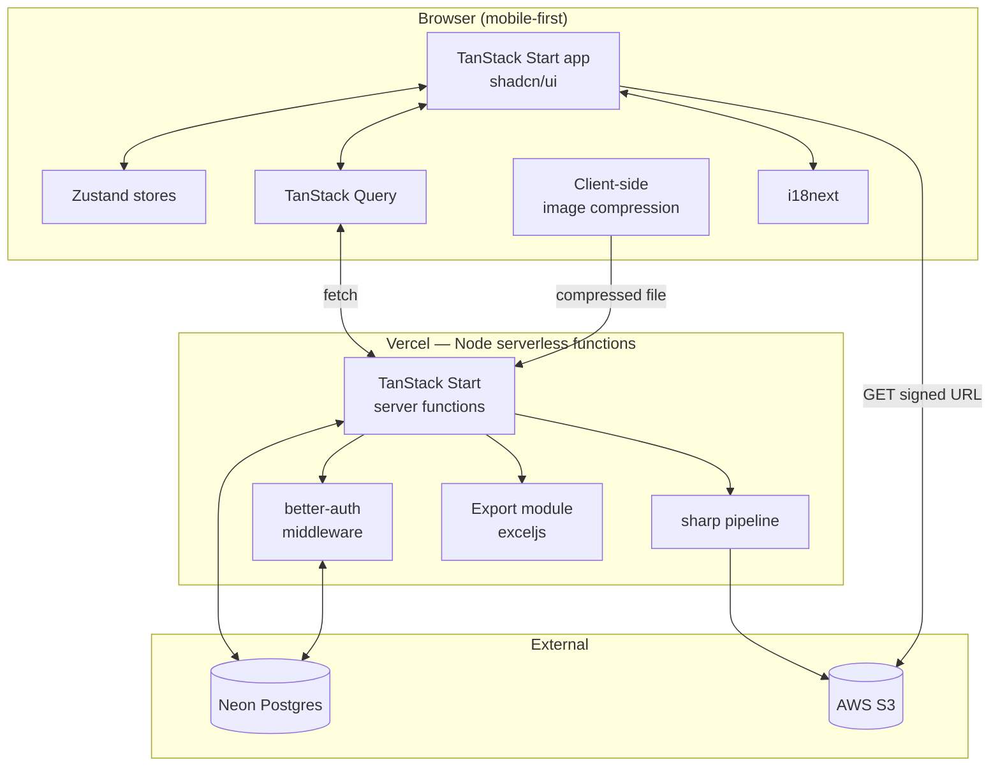

# ร้านหิ้ว Admin App — Architecture & Implementation Plan

**Author:** drafted with Point  
**Date:** 2026-05-17  
**Status:** Draft v3

### Changelog v2 → v3
- **Runtime / deploy** moved from Cloudflare Workers back to a **Node serverless platform — Vercel** (Netlify is an equivalent fallback). Restores `sharp`, removes M0 spike risk, simplifies image pipeline and DB driver choices.
- **Fee model overhauled.** Replaced the three-model selector with an **effective FX rate** + optional **per-item fee** + per-product manual override. Matches how Chom actually thinks about pricing.
- **Currencies** now first-class: JPY, USD, GBP, HKD, AUD, plus extensible via app settings. Each round picks one.
- **i18n added.** Thai default, English alternative. Cookie-based locale switch. UI strings, validation messages, date/number formatting localized. User-entered data is never translated.
- **Image pipeline** simplified — server-side `sharp` for thumbnails is back, client-side compression remains for faster mobile uploads. **Storage: AWS S3** (switched from R2).
- **มัดจำ default** removed — manual entry only, per Chom's answer.
- Per-user logins question (§16) still open.

### Changelog v1 → v2 (kept for history)
- Added Cloudflare Workers, R2, presigned uploads, M0 spike. *(Reverted in v3.)*
- Added better-auth, Bun, deposits (`order_payments`), shipping-fee presets, optional product photos.

---

## 1. Goal

Replace the manual Excel workflow that Chom and her friend run today with a focused internal web app. The chat-based ordering on LINE/Instagram stays untouched. The app replaces:

- The `japan 05` workbook (raw orders → product aggregation → customer totals + payment status)
- The `kerry - 21-05-2026` shipping manifest

Plus it makes the **hot path** (typing in orders from chat messages) faster through autocomplete on customers, addresses, and products.

Two users today (Chom + air-hostess friend). Bilingual Thai/English UI, Thai default. Designed for that scale.

---

## 2. Pricing model — corrected

Chom doesn't think in "market rate + percent fee." She thinks in **one effective rate** that's intentionally higher than the market rate, optionally **plus a small fixed fee**, with **manual override** when she wants to round the price or hit a psychologically nice number.

So the model is:

```
sell_price_thb = foreign_price × effective_fx_rate + per_item_fee_thb
                                                  ^
                                                  optional, default 0
```

Per product, the operator can override `sell_price_thb` directly — that's the "manual adjustment" path.

Round configuration UI:
```
Source currency           [ JPY ▼ ]
Market rate (reference)   ฿0.220 / ¥1     ← shown for context, not stored
Effective rate (used)     [ 0.235      ]  ← what gets applied
Per-item fee (optional)   [ 0          ] THB
                          ─────────────
Example: ¥2,800 →           ฿658.00      ← live preview
```

This is **simpler than v2's three-model design** and matches the existing mental model. The schema reflects this.

---

## 3. Open questions — resolution status

| # | Question | Resolution |
|---|---|---|
| 1 | Per-user or shared login | **Still open.** Default assumption: per-user (audit log is more useful, better-auth handles it cheaply). Confirm with Chom before M3. |
| 2 | Fee model | **Effective FX rate + optional per-item fee + manual override.** See §2. |
| 3 | Source currencies | JPY, USD, GBP, HKD, AUD initially. Add more via `app_settings.source_currencies` without code change. |
| 4 | Real Kerry template | Use the existing template file. Need a copy checked into the repo as the golden file before M4. |
| 5 | มัดจำ default | **Manual entry, no default amount.** |
| 6 | Multiple addresses per customer | Yes — default + history. |
| 7 | Product photos | Optional. Upload via standard file picker (camera on mobile, library on desktop). |
| 8 | Cancellations | `cancelled` status, excluded from totals. |
| 9 | Currency display | Sell in THB. Show source currency on round-product editor and order detail. |
| 10 | Thai script in autocomplete | Handled by pg_trgm + simple FTS. |

---

## 4. Domain model

```mermaid
erDiagram
    USER ||--o{ AUDIT_LOG : "writes"
    ROUND ||--o{ ROUND_PRODUCT : has
    ROUND ||--o{ ORDER : contains
    PRODUCT ||--o{ ROUND_PRODUCT : "priced into"
    CUSTOMER ||--o{ CUSTOMER_ADDRESS : has
    CUSTOMER ||--o{ ORDER : places
    CUSTOMER_ADDRESS ||--o{ ORDER : "ships to"
    ORDER ||--o{ ORDER_ITEM : has
    ORDER ||--o{ ORDER_PAYMENT : has
    ROUND_PRODUCT ||--o{ ORDER_ITEM : "ordered as"

    USER { text id PK; text email; text name; text role; timestamptz created_at }
    ROUND { uuid id PK; text name; text country; text store_hint; date purchase_start; date purchase_end; date delivery_eta; text status; text source_currency; numeric fx_rate; numeric per_item_fee_thb; numeric default_shipping_fee; timestamptz created_at }
    PRODUCT { uuid id PK; text name; text brand; text source_country; text category; text image_key; text thumb_key; timestamptz last_used_at }
    ROUND_PRODUCT { uuid id PK; uuid round_id FK; uuid product_id FK; numeric foreign_price; numeric sell_price_thb; bool price_overridden; text store_location; text notes }
    CUSTOMER { uuid id PK; text display_name; text line_id; text instagram_handle; text phone; text notes; timestamptz last_ordered_at }
    CUSTOMER_ADDRESS { uuid id PK; uuid customer_id FK; text recipient_name; text mobile; text address; text postal_code; bool is_default; timestamptz created_at }
    ORDER { uuid id PK; uuid round_id FK; uuid customer_id FK; uuid address_id FK; numeric subtotal_thb; numeric shipping_fee_thb; numeric total_thb; numeric paid_amount_thb; text payment_status; text kerry_tracking; text status; text notes }
    ORDER_ITEM { uuid id PK; uuid order_id FK; uuid round_product_id FK; int quantity; numeric unit_price_thb; numeric line_total_thb }
    ORDER_PAYMENT { uuid id PK; uuid order_id FK; numeric amount_thb; text type; timestamptz paid_at; text method; text notes }
```

`PRODUCT` (catalog) is separate from `ROUND_PRODUCT` (priced snapshot). `price_overridden` flag on round_product distinguishes calculated vs. manually-set prices so we can re-apply the formula in bulk without clobbering overrides.

---

## 5. Database schema (Postgres on Neon)

```sql
create extension if not exists pg_trgm;
create extension if not exists unaccent;
create extension if not exists citext;
create extension if not exists "uuid-ossp";

-- better-auth manages "user", "session", "account", "verification" tables.
-- Roles in a separate table so we don't fork better-auth's schema.
create table user_roles (
  user_id text primary key references "user"(id) on delete cascade,
  role text not null check (role in ('admin','operator')) default 'operator'
);

-- Catalog
create table products (
  id uuid primary key default uuid_generate_v4(),
  name text not null,
  brand text,
  source_country text,
  category text,
  image_key text,
  thumb_key text,
  search_doc tsvector
    generated always as (
      to_tsvector('simple', unaccent(coalesce(name,'') || ' ' || coalesce(brand,'') || ' ' || coalesce(category,'')))
    ) stored,
  last_used_at timestamptz,
  created_at timestamptz not null default now()
);
create index products_trgm_idx on products using gin (name gin_trgm_ops);
create index products_fts_idx  on products using gin (search_doc);
create index products_last_used_idx on products (last_used_at desc nulls last);

-- Rounds
create table rounds (
  id uuid primary key default uuid_generate_v4(),
  name text not null,
  country text not null,
  store_hint text,
  purchase_start date,
  purchase_end date,
  delivery_eta date,
  status text not null check (status in ('draft','open','closed','shipping','done','archived')) default 'draft',
  source_currency text not null,                       -- 'JPY', 'USD', 'GBP', 'HKD', 'AUD', ...
  fx_rate numeric(12,6) not null,                      -- EFFECTIVE rate (already includes markup over market)
  per_item_fee_thb numeric(12,2) not null default 0,   -- optional flat addition per item
  default_shipping_fee numeric(12,2) not null default 50,
  notes text,
  created_by text references "user"(id),
  created_at timestamptz not null default now()
);

create table round_products (
  id uuid primary key default uuid_generate_v4(),
  round_id uuid not null references rounds(id) on delete cascade,
  product_id uuid not null references products(id),
  foreign_price numeric(12,2) not null,
  sell_price_thb numeric(12,2) not null,               -- stored even when computed, so manual override works
  price_overridden boolean not null default false,     -- if true, recompute won't touch it
  store_location text,
  notes text,
  created_at timestamptz not null default now(),
  unique (round_id, product_id)
);
create index round_products_round_idx on round_products (round_id);

-- Customers
create table customers (
  id uuid primary key default uuid_generate_v4(),
  display_name text not null,
  line_id text,
  instagram_handle text,
  phone text,
  notes text,
  last_ordered_at timestamptz,
  created_at timestamptz not null default now()
);
create index customers_trgm_idx on customers using gin (display_name gin_trgm_ops);
create index customers_phone_idx on customers (phone);
create index customers_last_ordered_idx on customers (last_ordered_at desc nulls last);

create table customer_addresses (
  id uuid primary key default uuid_generate_v4(),
  customer_id uuid not null references customers(id) on delete cascade,
  recipient_name text not null,
  mobile text not null,
  address text not null,
  postal_code text not null,
  is_default boolean not null default false,
  created_at timestamptz not null default now()
);
create index customer_addresses_customer_idx on customer_addresses (customer_id);
create unique index one_default_address_per_customer
  on customer_addresses (customer_id) where is_default;

-- Orders
create table orders (
  id uuid primary key default uuid_generate_v4(),
  round_id uuid not null references rounds(id) on delete restrict,
  customer_id uuid not null references customers(id) on delete restrict,
  address_id uuid references customer_addresses(id),
  subtotal_thb numeric(12,2) not null default 0,
  shipping_fee_thb numeric(12,2) not null default 50,
  total_thb numeric(12,2) not null default 0,
  paid_amount_thb numeric(12,2) not null default 0,    -- cached sum from order_payments
  payment_status text not null
    check (payment_status in ('pending','partial','paid','refunded'))
    default 'pending',
  kerry_tracking text,
  status text not null check (status in ('active','cancelled')) default 'active',
  notes text,
  created_at timestamptz not null default now(),
  updated_at timestamptz not null default now()
);
create index orders_round_idx on orders (round_id);
create index orders_customer_idx on orders (customer_id);
create index orders_payment_status_idx on orders (round_id, payment_status);

create table order_items (
  id uuid primary key default uuid_generate_v4(),
  order_id uuid not null references orders(id) on delete cascade,
  round_product_id uuid not null references round_products(id) on delete restrict,
  quantity int not null check (quantity > 0),
  unit_price_thb numeric(12,2) not null,
  line_total_thb numeric(12,2) not null
);
create index order_items_order_idx on order_items (order_id);

-- Payments
create table order_payments (
  id uuid primary key default uuid_generate_v4(),
  order_id uuid not null references orders(id) on delete cascade,
  amount_thb numeric(12,2) not null,
  type text not null check (type in ('deposit','remainder','full','refund')),
  paid_at timestamptz not null default now(),
  method text,
  notes text,
  recorded_by text references "user"(id)
);
create index order_payments_order_idx on order_payments (order_id, paid_at);

-- Settings
create table app_settings (
  key text primary key,
  value jsonb not null,
  updated_at timestamptz not null default now()
);
-- Seed:
--   ('shipping_fee_presets', '[39, 50, 80]')
--   ('default_shipping_fee', '50')
--   ('source_currencies', '["JPY","USD","GBP","HKD","AUD"]')
--   ('default_locale', '"th"')

-- Audit
create table audit_log (
  id bigserial primary key,
  user_id text references "user"(id),
  entity text not null,
  entity_id text not null,
  action text not null,
  diff jsonb,
  at timestamptz not null default now()
);
create index audit_log_entity_idx on audit_log (entity, entity_id, at desc);
```

Same `recompute_order_payment_status` trigger as v2 — refreshes `paid_amount_thb` and `payment_status` whenever `order_payments` changes.

---

## 6. Internationalization (i18n)

**Default locale: Thai (`th`). Alternative: English (`en`).**

### Library choice: `i18next` + `react-i18next`

Why: mature, framework-agnostic, plays nicely with TanStack Router's loader pattern, has Intl-aware date/number plugins, supports namespaced bundles for code-splitting. Lingui was the alternative but its build-time macros add Vite plugin complexity.

### Locale resolution order
1. `?lang=` query param (one-shot override, useful for testing)
2. `locale` cookie (set when user picks from the language switcher in the UI)
3. `Accept-Language` request header
4. App default (`th`)

The choice is read in a `__root.tsx` `beforeLoad` and passed through context so SSR renders in the right language on the first paint. No flicker.

### Bundle structure
```
src/locales/
  th/
    common.json       # buttons, nav, generic
    auth.json
    rounds.json
    orders.json
    customers.json
    products.json
    payments.json
    exports.json
    errors.json
  en/
    (mirror)
```

Translations are loaded by namespace per route so we don't ship every string to the login page.

### Formatting
- **Dates**: `Intl.DateTimeFormat('th-TH', { dateStyle: 'medium' })` → "17 พ.ค. 2569" by default. English locale → "May 17, 2026". Thai uses the Buddhist calendar by default; use the `calendar: 'gregory'` option if Gregorian dates are preferred (worth confirming with Chom — Thai e-commerce typically uses Gregorian).
- **Numbers / currency**: `Intl.NumberFormat('th-TH', { style: 'currency', currency: 'THB' })` → "฿4,800.00".
- **Foreign currency display**: same Intl API, currency code from the round.

### What does NOT get translated
- User-entered data: product names, customer names, notes, addresses — kept verbatim regardless of UI locale. Names typed in Thai stay Thai.
- Excel export sheet names and column headers — kept in **Thai** to match the existing workflow (`สรุปยอด`, `รวมยอดลูกค้า`). Operators distribute these to people who expect the Thai labels.
- Kerry template headers — bilingual as the template requires (`*ชื่อผู้รับ/Recipient Name`), regardless of UI locale.

### Validation messages
zod schemas use a small i18n wrapper:
```ts
const orderItemSchema = z.object({
  quantity: z.number().int().positive(t('errors:quantity.positive')),
  // ...
});
```
Validation messages flow through the same translation files.

### Language switcher
A simple dropdown in the user menu. Sets the cookie and reloads the route (TanStack Router can re-run loaders without a full page refresh).

### Translation coverage check
A CI step diffs the keys in `th/` vs `en/` and fails if there's drift. Catches "added a new string but forgot to translate" before merge.

---

## 7. Auto-suggest / search strategy

Unchanged from v1/v2. `pg_trgm` + `tsvector` over Drizzle on Neon. No change with the Node runtime — actually faster because TCP pooling beats HTTP per-query.

Customer autocomplete query (recap):
```sql
select id, display_name, phone, line_id, last_ordered_at,
       similarity(display_name, $1) as sim
from customers
where display_name ilike $1 || '%'
   or display_name % $1
   or phone ilike '%' || $1 || '%'
   or line_id ilike '%' || $1 || '%'
order by (display_name ilike $1 || '%') desc,
         sim desc,
         last_ordered_at desc nulls last
limit 8;
```

---

## 8. System architecture



Flow:
- File uploads go through the Node function. Client compresses for speed and bandwidth (mobile especially), server uses `sharp` to make a canonical (1024px WebP) and a thumb (200px WebP), stores both in R2.
- Thumbnails are pre-generated, not on-the-fly — predictable URLs, easier to cache.
- DB uses Neon's serverless HTTP driver. Works perfectly in Vercel functions, handles cold starts gracefully, no connection-pool exhaustion at this scale.

---

## 9. Tech stack — locked

| Layer | Choice | Notes |
|---|---|---|
| Language | TypeScript (strict) | |
| Runtime | **Node 22 on Vercel** | Netlify is an equivalent fallback. |
| Framework | TanStack Start | Vercel deploy preset, SSR + server functions |
| Package manager | Bun | Install + scripts. Vercel build runs Bun via `corepack` or build command override. |
| DB | Neon Postgres | `pg_trgm`, `unaccent`, `citext`. Pooled connection string for serverless. |
| DB driver | `@neondatabase/serverless` | HTTP driver, works for both pooled and unpooled needs. |
| ORM | Drizzle (`drizzle-orm/neon-http`) | |
| Migrations | drizzle-kit | `bun drizzle-kit generate / migrate` |
| Auth | better-auth + Drizzle adapter | Email/password, cookie sessions |
| Storage | AWS S3 | Standard IAM auth, presigned URLs, lifecycle policies. |
| S3 client | `@aws-sdk/client-s3` | Works against both R2 and S3 |
| Image processing | `sharp` | Server-side, WebP output |
| Client image compression | `browser-image-compression` | Reduces mobile upload time |
| i18n | i18next + react-i18next | Default `th`, alt `en` |
| UI | shadcn/ui + Tailwind | Custom theme — see §12 |
| Forms | react-hook-form + zod | |
| Query | TanStack Query v5 | |
| State | Zustand | UI + order-draft only |
| Charts | shadcn charts (recharts) | |
| Excel export | `exceljs` | Server-side, streamed |
| Tests | Vitest + Playwright | |
| Lint/format | Biome | |
| Deploy | Vercel (via `vercel.json` or auto-detected) | |

---

## 10. Authentication & authorization

Same as v2: better-auth with Drizzle adapter, email/password, cookie sessions, argon2id hashing.

```ts
// src/server/auth.ts
import { betterAuth } from 'better-auth';
import { drizzleAdapter } from 'better-auth/adapters/drizzle';
import { db } from './db';

export const auth = betterAuth({
  database: drizzleAdapter(db, { provider: 'pg' }),
  emailAndPassword: { enabled: true, autoSignIn: false },
  session: {
    expiresIn: 60 * 60 * 24 * 30,
    updateAge: 60 * 60 * 24,
    cookieCache: { enabled: true, maxAge: 60 * 5 },
  },
  advanced: { useSecureCookies: true, defaultCookieAttributes: { sameSite: 'lax' } },
});
```

- Two roles: `admin`, `operator`.
- Server function middleware checks session + role on every protected call.
- First admin created via `bun run scripts/create-user.ts --email ... --role admin`. No public signup. No HTTP admin-creation endpoint until needed.
- Rate-limit `/api/auth/sign-in` via a Postgres counter or Vercel's edge config — either works.

---

## 11. File storage & image pipeline

Photos are optional. A round can be published with zero photos.

### Upload flow
1. User picks a file on the product detail page.
2. Browser compresses via `browser-image-compression` (max 1024px, WebP q0.8, ~300KB target). This is a UX optimization for slow mobile networks, not a security boundary.
3. Client posts the compressed file to `POST /api/products/{id}/image` as multipart.
4. Server function:
   - Validates file (mime, size, magic bytes).
   - `sharp` produces:
     - Canonical: max 1024px long edge, WebP q80, strip EXIF.
     - Thumb: 200×200 cover-crop, WebP q70.
   - Uploads both to S3 with keys `products/{id}/canonical-{hash}.webp` and `products/{id}/thumb-{hash}.webp`.
   - Updates `products.image_key` and `thumb_key`.

### Serving
- Originals private. Thumbs served via presigned URLs or a public S3 bucket prefix with appropriate bucket policy.
- Cache headers: `Cache-Control: public, max-age=31536000, immutable` — keys include content hash, so we never invalidate.

### Why S3
- Standard AWS IAM and bucket policies for access control.
- Native lifecycle rules for photo recovery and archival.
- Same `@aws-sdk/client-s3` SDK used throughout.

---

## 12. API design (server functions)

Same shape as v2. Grouped by domain, every function authenticated, every mutation validated with zod and written to `audit_log`.

Notable functions:
- `auth/` — handled by better-auth's mounted route.
- `rounds/` — list, get, create, update, closeRound.
- `roundProducts/` — list, upsertMany (bulk price-set), recomputeFromFx (re-apply formula to non-overridden rows when fx_rate changes mid-round).
- `catalog/products` — search, upsert, uploadImage.
- `customers/` — search (autocomplete), get, upsert; addresses sub-routes.
- `orders/` — list (filterable), get, create, update, markPaid, cancel, setTracking.
- `payments/` — record (deposit / remainder / full / refund).
- `exports/japan05` — XLSX stream.
- `exports/kerry` — XLSX stream.
- `dashboard/roundStats`, `dashboard/overallStats` — aggregations.
- `settings/get`, `settings/update` — admin only.

---

## 13. Frontend architecture

### Routes

```
src/routes/
  __root.tsx                       layout + auth + locale
  login.tsx                        public
  _app/                            auth-required layout
    index.tsx                      → /rounds
    rounds.tsx
    rounds/new.tsx
    rounds/$roundId/
      index.tsx                    overview + tabs
      products.tsx                 round_products editor (with FX live calc)
      orders/
        index.tsx                  filterable order list
        new.tsx                    ← hot path
        $orderId.tsx               edit
        $orderId/payments.tsx      payment history + record
      summary.tsx                  สรุปยอด
      customers.tsx                รวมยอดลูกค้า
      shipping.tsx                 Kerry manifest preview + export
      stats.tsx                    charts
    customers.tsx
    customers/$customerId.tsx
    products.tsx
    products/$productId.tsx
    settings.tsx                   admin only
```

### State

- **TanStack Query** for all server data; keyed by domain + filters.
- **Optimistic updates** on `markPaid`, `recordPayment`, line edits, `cancel`.
- **Zustand**:
  - Current round context.
  - **Order draft store** persisted to `localStorage` — line items being typed. Survives tab refresh. Critical for the hot path.
  - UI prefs (sidebar, theme, locale).

### Forms
react-hook-form + zod. Schemas in `src/shared/schemas/`, imported on both sides. zod messages flow through i18next.

### Live FX calculator (round-products editor)

```
Round: Japan 05    Currency: JPY    Effective rate: 0.235   Per-item fee: ฿0

Foreign price [   ¥2,800   ]
Computed price                          ฿658.00
Manual override [   ฿680   ]  [✓ override]  ← when set, calc won't touch it
Store           [ Don Quijote Shinjuku  ]
```

When the round's `fx_rate` or `per_item_fee_thb` changes, a `recomputeFromFx` action re-applies the formula to all rows where `price_overridden = false`. Overridden rows are left alone.

### Mobile-first

Unchanged: bottom tab bar on mobile, sidebar ≥md; sticky-bottom CTAs; 44px tap targets; 16px input font; numeric / tel keyboards; virtualized lists; PWA manifest.

### The hot path

`/rounds/$roundId/orders/new` — same layout as v2. Optimized so the second-most-common screen (recording a payment after a customer transfers money) is one tap away from the order detail.

Payment recording sheet (slides up from bottom on mobile):
```
Record payment — Order #142
Total ฿12,080  ·  Paid ฿0

Amount  [ ฿                 ] THB    ← no default; manual entry
Type    (●) มัดจำ deposit
        (○) Remainder
        (○) Full payment
Method  [ Bank transfer  ▼ ]
Notes   [                 ]

[ Cancel ]              [ Save ]
```

### Aesthetic direction

Same as v1/v2: editorial calm × utilitarian density. IBM Plex Sans Thai Looped (body — handles Thai + Latin well), Fraunces (display), IBM Plex Mono (numerics with `tabular-nums`). Bone background, ink text, hanko-red accent. Dark mode required.

Verify with Chom which Thai font she prefers — Plex Sans Thai Looped is opinionated; Sarabun or Noto Sans Thai are safer fallbacks.

---

## 14. Export functionality

`exceljs` server-side. Returns the XLSX as a streamed response with `Content-Disposition: attachment`.

### `japan05.xlsx`

Three sheets:

**Orders** — flat list, one row per order_item.
| Customer | Product | Qty | Unit (฿) | Line total (฿) | Store | Payment status |

**สรุปยอด** — aggregated by product.
| Product | Total qty | Store | Foreign unit | Foreign total | THB unit | THB total |

**รวมยอดลูกค้า** — per-customer summary.
| ชื่อลูกค้า | รวมยอด | ค่าส่ง | รวมทั้งหมด | จ่ายแล้ว | คงเหลือ | สถานะ |

Sheet names and column headers stay in Thai regardless of UI locale. They go out to people who expect Thai labels.

Formatting:
- Tabular ฿ format `#,##0.00`
- Frozen top row
- Auto-filter
- Conditional formatting on `สถานะ`: paid = green, มัดจำ = amber, pending = light gray

### `kerry.xlsx`

Single sheet, headers exactly:
```
No | *ชื่อผู้รับ/Recipient Name | *เบอร์ผู้รับ/Mobile No. | *ที่อยู่/Address | *รหัสไปรษณีย์/Postal code
```

Headers stored as a constant tied to a **golden-file test** that compares the exported header row byte-for-byte against a checked-in `kerry-template.xlsx`. Get the real template from Chom before M4 and check it in.

Default filter: orders with `payment_status IN ('paid', 'partial')` — partial-paid (มัดจำ) customers usually ship too. Toggleable.

---

## 15. Dashboard & analytics

### Per-round
- KPIs: total orders, total revenue ฿, cost (foreign × fx), gross margin, outstanding balance, paid count / total count.
- Payment funnel chart: pending → partial → paid (counts and ฿).
- Top 10 products by qty.
- Top 10 customers by spend.
- Daily orders received during the round (line chart).

### Cross-round
- Last 6 rounds revenue + margin trend.
- Repeat customer rate.
- Top all-time customers.
- Per-country round count.

All aggregation in SQL. Materialize `round_stats` view if any single dashboard query exceeds 500ms.

---

## 16. Implementation phases

### M1 — Skeleton (1 week)
- Repo scaffold, Bun, Biome, Tailwind, shadcn.
- Theme tokens, font loading.
- **i18next set up with th/en, locale resolution, cookie-based switching.**
- Drizzle schema, migrations, seed.
- better-auth wired in, login screen, `create-user` CLI.
- Bottom-nav shell.
- Vercel deploy on `main` push.
- **Exit criteria**: log in on mobile, see empty rounds list, switch UI between Thai and English. Deploy via `git push`.

### M2 — Catalog + rounds (1.5 weeks)
- Product CRUD with optional photo upload (compression → server sharp → S3).
- Round CRUD with currency picker, effective FX rate, per-item fee.
- Round-product editor with live FX calculator and override flag.
- `recomputeFromFx` when round rate/fee changes.
- App settings page for shipping fee presets and currencies.
- **Exit criteria**: Chom creates "Japan May 2026" with 30 products, prices set, a few manual overrides applied.

### M3 — Orders, hot path (2 weeks)
- Customer + address upsert with autocomplete.
- New-order screen, product autocomplete (round-scoped + catalog fallback).
- Line items + shipping fee preset picker.
- Optimistic updates everywhere.
- localStorage draft persistence.
- Payment recording (deposit + remainder + full + refund) via slide-up sheet.
- **Exit criteria**: team enters a real round end-to-end on mobile. Stopwatch 10 orders. Must beat Excel by ≥25%.

### M4 — Exports + migration (1 week)
- `japan05.xlsx` (3 sheets, Thai headers).
- `kerry.xlsx` with golden-file test against the real Kerry template.
- One-off `bun run scripts/import-xlsx.ts` to backfill the in-flight round.
- **Exit criteria**: Kerry labels for a real round are printed entirely from the app.

### M5 — Dashboards + polish (1 week)
- Per-round and cross-round stats.
- Payment funnel chart.
- Dark mode polish.
- PWA manifest.
- Keyboard shortcuts on desktop.
- Audit log viewer (admin only).
- **Exit criteria**: Excel workflow is retired.

### Out of scope v1
- LINE/Instagram chat integration.
- Customer-facing portal.
- SMS / LINE notifications on payment.
- Returns money flow beyond recording refunds.
- OCR-from-screenshot of chat messages.
- **Purchasing-companion mode** (in-store screen for the friend) — strong v1.1 candidate; schema already supports it.

### M6 — Order editing + inline product creation + order summary message (1 week)
- **Full order editing** — orders are editable after creation. On the order detail page (`orders/$orderId`), the operator can:
  - Change the customer.
  - Change the shipping address.
  - Adjust quantities on existing line items, or remove items entirely.
  - Add new line items via the product picker (same combobox as new-order page).
  - Update the shipping fee and notes.
  - All edits are persisted via an `updateOrder` server function that re-calculates subtotal and total. Payment history is never auto-adjusted (manual refund/adjustment only). Edits write to `audit_log`.
- **Inline product creation from combobox** — in both the new-order page and order-detail product picker, add a "Create new product" option at the bottom of the product combobox dropdown when no exact match is found. Opens a small dialog/modal with product name, brand, and foreign price. On save, the product is created, added to the current round as a `round_product` (priced via the round's FX rate), and immediately inserted as a line item. Eliminates the round-trip to the catalog page mid-order.
- **Export filenames use round name + delivery date** — the `japan05.xlsx` and `kerry.xlsx` exports set `Content-Disposition` filenames to `{roundName} - {deliveryDate}.xlsx` (e.g. `Japan 05 - 2026-05-30.xlsx`). The round data is fetched in the export route handler to populate the filename. Makes downloads self-documenting without the operator having to rename files manually.
- **Product name links to edit page everywhere** — wherever a product name is displayed (order line items, order detail, round-products editor, summary/exports tables), it renders as a `Link` to `/products/$productId`. Lets the operator jump straight to fix a typo, update a price, or add a photo without navigating through the catalog. Consistent with the customer name linking pattern already in orders and shipping pages.
- **Copyable order summary message** — on the order detail page, add a "Copy summary" button that generates a Thai-language message suitable for pasting into LINE/chat, formatted like:
  ```
  ขออนุญาติรวมยอดค่ะ 🙏
  รายการ:
  1. [Product name] ×[qty] — [line total] ฿
  2. [Product name] ×[qty] — [line total] ฿
  ...
  ค่าส่ง — [shipping] ฿
  รวมทั้งหมด — [total] ฿
  ชำระแล้ว — [paid] ฿
  คงเหลือ — [balance] ฿
  ```
  One-tap copy via `navigator.clipboard.writeText`. Shows a brief toast confirmation. Useful for sending payment reminders or order confirmations to customers.
- **Exit criteria**: operator can create a brand-new product mid-order without leaving the screen; operator can edit any field on an existing order; operator can copy-paste a formatted order summary into LINE in under 3 seconds.

---

## 17. Deployment

### Production topology

```
GitHub ──► Vercel (auto-deploy)
              │
              ├── Vercel Postgres adapter → Neon (prod branch)
              ├── AWS S3 bucket
              └── Vercel env vars (BETTER_AUTH_SECRET, DATABASE_URL, S3 creds)
```

Two Vercel environments:
- **Preview**: every PR gets its own URL, points at a Neon `staging` branch.
- **Production**: deploys on tag `v*` or main push to a `prod` branch.

### Setup checklist
1. Vercel project, link to GitHub repo.
2. Neon project with `prod` and `staging` branches.
3. S3 bucket + IAM user with `s3:PutObject` / `s3:GetObject` / `s3:DeleteObject` on the bucket.
4. Custom domain in Vercel.
5. Env vars set in Vercel dashboard: `DATABASE_URL`, `BETTER_AUTH_SECRET`, `BETTER_AUTH_URL`, `AWS_REGION`, `AWS_ACCESS_KEY_ID`, `AWS_SECRET_ACCESS_KEY`, `S3_BUCKET`, `S3_PUBLIC_URL`.
6. `bun` as the build command (Vercel auto-detects, otherwise set `installCommand: "bun install"` and `buildCommand: "bun run build"`).

### CI
GitHub Actions for things Vercel doesn't do:
- Typecheck, Biome, Vitest on PR.
- Drizzle migration check (`drizzle-kit check`) on PR.
- **Translation key parity check**: lint `th/` vs `en/` for missing keys.
- Playwright against the preview URL.

Vercel handles the actual deploy; no Wrangler-equivalent for us to maintain.

### Cost
- Vercel Hobby: free, fine for staging. Pro: $20/mo per member if it grows; for a 2-user internal tool you can stay on Hobby a long time.
- Neon: free tier carries this for ages, $19/mo when compute hours exceed.
- S3: ~$0.023/GB storage, ~$0.09/GB egress (negligible at this scale).
- Domain: ~$10/year.

**Total: $0–$20/mo realistically.**

If Vercel's pricing ever becomes a constraint, the same app deploys unchanged to:
- Netlify (similar Node functions model).
- Hetzner via Docker (you already operate this — `node` + `pm2` + Caddy).

No Workers-specific code, no lock-in.

---

## 18. Things to verify with Chom

1. **Per-user vs shared login** — still open. Default: per-user. Confirm before M3 to avoid rework on the audit log UI.
2. **Real Kerry template** — get the actual file Kerry currently accepts and check it in as the golden test artifact.
3. **Buddhist vs Gregorian calendar** in Thai date display — Thai e-commerce mostly uses Gregorian even when the UI is in Thai, but ask.
4. **Thai UI font preference** — Plex Sans Thai Looped is my proposal; Sarabun and Noto Sans Thai are reasonable fallbacks. Show two mockups, let her pick.
5. **Effective FX rate refresh** — when she changes the round's `fx_rate` mid-round, what's the expected behavior on existing round_products that have already been ordered? My default: leave existing `order_items.unit_price_thb` alone (they're frozen at order time), recompute `round_products.sell_price_thb` for not-yet-overridden rows only. Confirm.

---

## 19. Things you missed (carried over)

- **Data migration** in M4 — `bun run scripts/import-xlsx.ts` to backfill the in-flight round. Without this, team will refuse to switch mid-round.
- **Purchasing-companion mode** — high-leverage v1.1. Schema supports it; UI is one new screen.
- **Thai timezone**: Postgres stores UTC, all UI renders `Asia/Bangkok`.
- **Empty-state onboarding**: 5-minute first-run flow importing last round's products.
- **S3 versioning + lifecycle rules** for photo recovery.
- **Round vs shipping batch separation** — with deposits enabled, some customers ship later. Kerry export filter handles this; surface it in the UI.

---

*End of plan v3. Next step: confirm the five open items in §18 with Chom, then M1 starts.*
